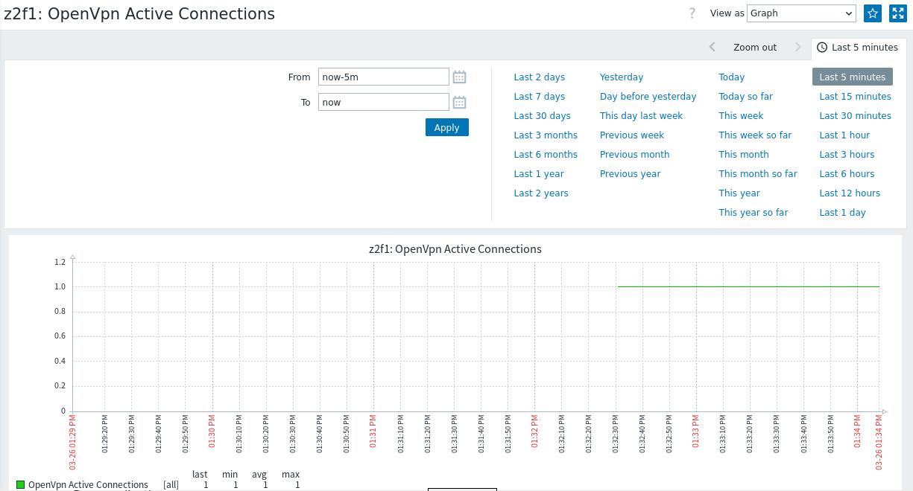

# openvpn-zabbix-openwrt


Latest Data Sections



Graph

# Installation
### 1. Clone this repository
```
git clone https://github.com/heshgggg/openvpn-zabbix-openwrt; cd openvpn-zabbix-openwrt
```
### 2. Copy all scripts to somepath
```
cp -r * /somepath/
```
### 3. Enable status write to status file function in openvpn
```
...
status path
...
```
### 4. Change the variable STATUS_FILE to the path to the file where the openvpn status is written

### 5. Set UserParameter on zabbix_agentd.conf

```
UserParameter=openvpn.monitor[*],/somepath/openvpn_monitor.sh $1 $2 $3
UserParameter=openvpn.authuser,/somepath/openvpn_auth_user_pass.sh
UserParameter=openvpn.authusercount,/somepath/openvpn_auth_user_pass_count.sh
UserParameter=openvpn.activeconnections,/somepath/openvpn_active_connection.sh
```

### 6. Restart zabbix_agent
```
/etc/init.d/zabbix_agentd restart
```
### 7. Import Zabbix Template from this repository xml file

Tested on Openwrt 24.10 and zabbix 7.2 


# Additionally
## Authentication with ldap

For openwrt there was no script for authentication via ldap. Therefore, a script was written. To use, add the configuration:
```
script-security 2
auth-user-pass-verify /somepath/ldap.sh via-file
auth-user-pass-optional
```

